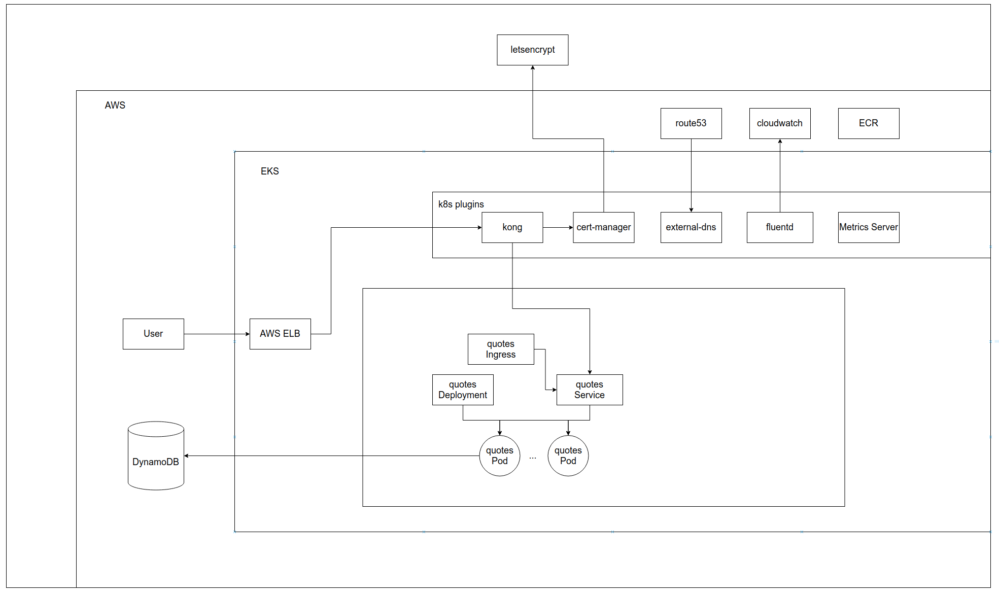
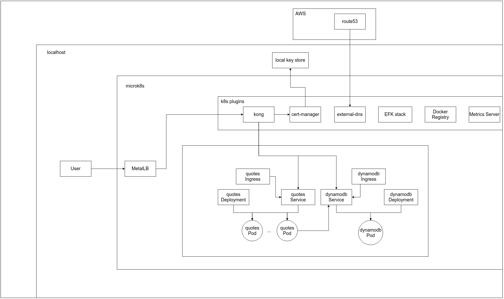

# Local Prod Demo

In this repository, I have all of the automation necessary to set up a production level environment (that I mistakenly called dev) and a production level local development environment. What I'm trying to show with this is that it is possible to run your applications with the same scruteny and techniques that you use for production environments. Doing things this way will not only help you have more confidence that your automation will work in production, but will allow you to more consistently test monitoring tools and strategies you have developed to work with prod by allowing you to use them locally.

## The dev (Prod!) environment


The prod environment has our quotes application running on EKS. It uses terraform to create a dynamodb table that it uses as a database. It receives traffic from the api-gateway kong that is preinstalled on the cluster using the backend automation. It has automatically updated certs that use letsencrypt as the certificate authority. DNS is managed by Route53. Logs are managed by cloudwatch, and images are managed by amazon ecr. I think most would agree that this is a pretty reasonable set up for many production workloads. The problem is how do you test it?

I've worked with stacks like this a lot over the last few years, and at first it's pretty intimidating. How can you possibly trust that everything's not going to fall apart once you try to run it either here or on a shared lower lifecycle environment? In this project I have written the automation necessary to run pretty much all of this an a single laptop. (Except for DNS, would love some help getting that part worked out)

## The local (Prod?) environment


The local environment is very similar to the production environment, with just a few tweaks to allow it to run locally. First, cert-manager is using self-signed certs, since letsencrypt will not let you create real certificates for private ip addresses. If you have access to static IPs you could actually get around this if you want and go online with this thing. I used EFK for log aggregation since that was easy to set up. I would've used it for the production environment too, but I didn't want to pay for that. It's using a local docker registry so that you don't have to upload your images anywhere to get them running. It's using metalLB to provide you a local loadbalancer for your kubernetes cluster. Finally, it's using a locally deployed dynamodb instance, so that you can make as many changes to it as you want without affecting others.

# Setup

## local environment

Since i didn't figure out how to get dns worked out locally in time, this can't quite be run locally by others due to the route53 dependency. If anyone wants to make that tweak though, here is the process.

```
backend/setup.sh local
```

This will set up everything shown in the diagram except for the quotes service and the dynamodb instance. One note is that it creates a root certificate that cert-manager uses to create all of it's self signed certificates. If you want that to be trusted locally, it drops the ca.crt into the tmp folder where you've run the script. You can add that to your trust store in order to make it trusted by your computer. Also you can add the microk8s dns server to your machine's dns system in order to resolve the kubernetes internal host names. The ip address for that can be found with the following: `kubectl get svc -n kube-system kube-dns -ojsonpath='{.spec.clusterIP}'`

With that done the deployment of the quotes service can be done easily with the following.

```
cd quotes
VERSION=$(date +%s)
cicd/scripts/build.sh ${VERSION}
cicd/scripts/publish.sh -l local -v ${VERSION}
cicd/scripts/deploy.sh -l local -r application -v ${VERSION}
```

## dev environment

All of this is working in my aws account, but I think it would require a few tweaks to work elsewhere. In case anyone feels like making those tweaks or just wants to steal this whole project, here's the process.

```
cd quotes
cicd/scripts/deploy.sh -l dev -r database
cd -
```

This sets up the dynamodb table and the iam policy needed to access it. This needs to be done before the EKS set up because that policy is necessary to set up the kubernetes service account to iam role authentication mapping.

```
backend/setup.sh dev
```

This script will set up the eks cluster with configurations that I have found useful when running EKS clusters. It sets up all of the plugins, including kong, cert-manager, external-dns, etc that were shown in the diagram, as well as the elb used for ingress.

After running these two scripts you have all of the backend required to deploy the quote service. The quote service can be deployed simply by running the following. It includes the set up for it's ecr repository so you don't need to worry about that either.

```
cd quotes
VERSION=$(date +%s)
cicd/scripts/build.sh ${VERSION}
cicd/scripts/publish.sh -l dev -v ${VERSION}
cicd/scripts/deploy.sh -l dev -r application -v ${VERSION}
```
